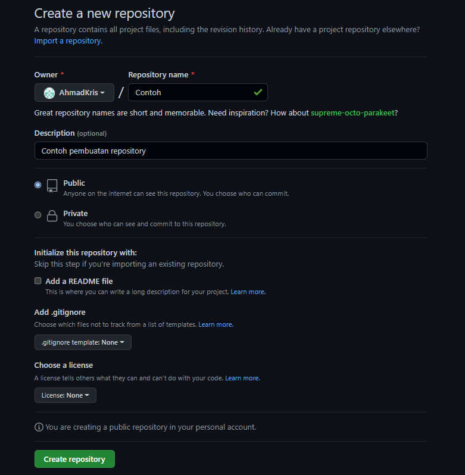

# (03) Basic Version Control and Branch Management (Git)

## Data Diri
Nomor Urut &nbsp;: 1_002FLB_44  
Nama &emsp;&emsp;&ensp;&nbsp;: Ahmad Krisdiantoro

## Summary
Pada section ini saya belajar : 
1. Cara membuat repository di github

2. Menghubungkan VScode ke repository di github 

3. Tiga

## Task 
### Task 01
