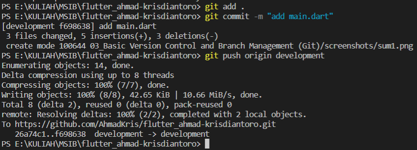
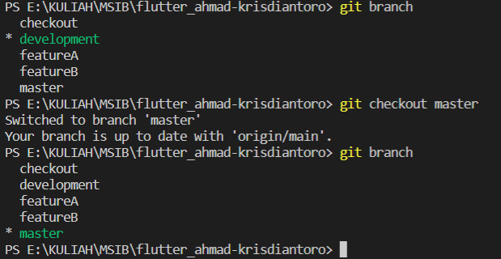
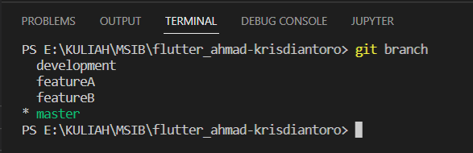
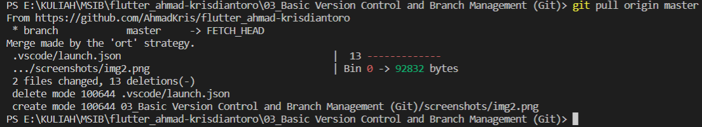
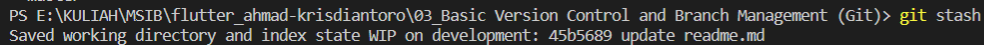
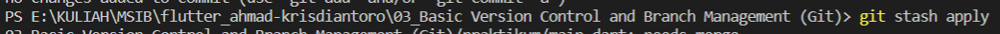

# (03) Basic Version Control and Branch Management (Git)

## Data Diri
Nomor Urut &nbsp;: 1_002FLB_44  
Nama &emsp;&emsp;&ensp;&nbsp;: Ahmad Krisdiantoro

## Summary
Pada section ini saya belajar : 
1. Cara membuat repository di github  

2. Belajar menggunankan git add, git commit, git push  

3. Belajar Branch  

## Task 
### Task 01
Membuat repository di github  

### Task 02
Implementasi Branching  

### Task 03
Implementasi instruksi git
1. push  
   
2. pull  
   
3. stash
   
   Setelah itu lakukan fixing, jika sudah lakukan add,commit, push. jika sudah maka apply
   
   apabila terjadi conflict maka akan di diskusikan bersama tim.
4. merge
   
