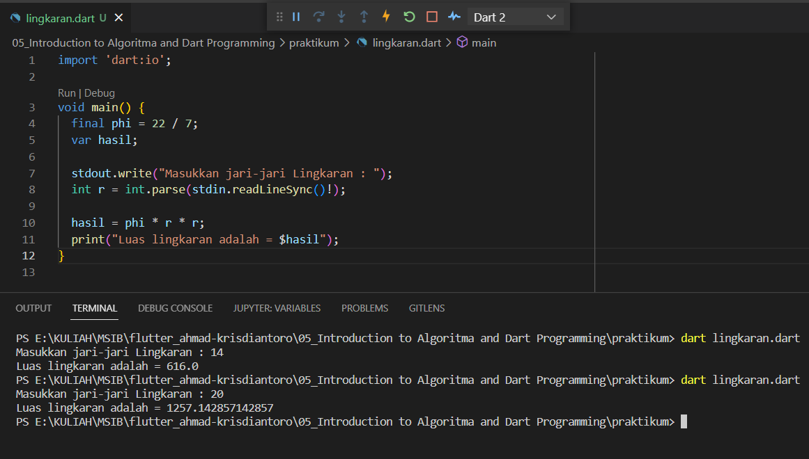
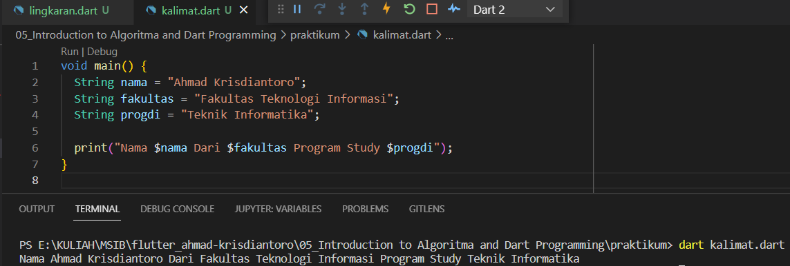

# (06) Basic Dart Programming

## Data Diri
Nomor Urut &nbsp;: 1_002FLB_44 
Nama &emsp;&emsp;&ensp;&nbsp;: Ahmad Krisdiantoro

## Summary
Pada section ini saya belajar : 
1. Bahasa Pemrograman Dart 
    Dart adalah bahasa pemrograman yang dikembangkan oleh google dan berbasis cross platform.
2. Fungsi Main 
    Fungsi main adalah bagian pertama yang di jalankan oleh program.
3. Variabel 
    Variabel adalah sebuah tempat untuk menyimpan data, memiliki nama dan tipe data tertentu.
4. Konstanta 
    Konstanta adalah tempat untuk menyimpan data yang memiliki nama dan tipe data tertentu namun nilainya tidak dapat diubah atau tetap.
5. Tipe Data 
    Tipe data adalah pengklasifikasian sebuah data berdasarkan jenis yang dapat dikelola.
6. Operator 
    Sebuah simbol yang digunakan untuk operasi pengolahan data.
    1. Arithmetic.  
    +, -, *, /, %
    2. Assignment. 
    =, +=, -=, *=, /=, %=
    3. Comparisson. 
    ==, <, >, <=, >=,
    4. Logical. 
    &&, ||, !
7. Anonymous Function
    Fungsi yang tidak memiliki nama.
8. Arrow Function.
    Fungsi yang bisa memiliki nama atau tidak, berisi 1 data dari proses maupun data statis. Nilai return di ambil dari data tersebut.
9. Async-Await.
    - Menjalankan beberapa proses tanpa perlu menunggu.
    - Proses ditulis dalam bentuk fungsi.
    - Await akan menunggu hingga proses async selesai.
10. Collection.
    Suatu objek yang dapat digunakan untuk menyinpan sekumpulan objek.

## Task 
### Task 01
Implementasi rumus luas lingkaran pada program dart. 

Penjelasan code : 
1. import library 'dart:io'
2. deklarasi sebuah konstanta dengan nama 'phi' dengan nilai '22 / 7'.
3. deklarasi variabel 'hasil'.
4. membuat sebuah inputan dinamis yang nantinya akan di simpan di variabel 'r'.
5. membuat rumus lingkaran 'hasil = phi * r * r'.
6. Mencetak kalimat 'Luas Lingkaran Adalah = ' dengan memanggil isi dari variabel '$hasil'.

### Task 02
Menyambung String menjadi sebuah kalimat. 

Penjelasan code : 
1. Membuat sebuah fungsi main.
2. Mendeklarasi variabel dengan tipe data String 'nama', 'fakultas', 'progdi'.
3. Mencetak kalimat dengan memanggil isi dari masing-masing variabel.