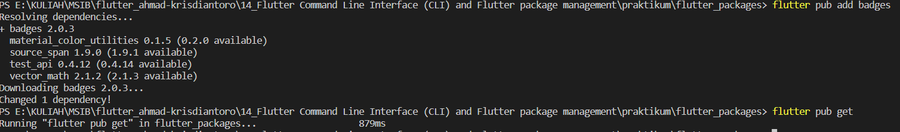
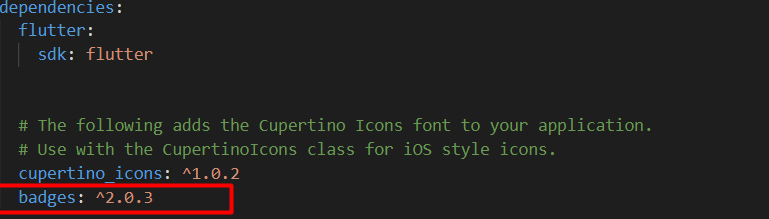
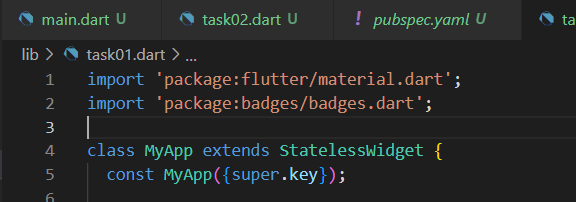
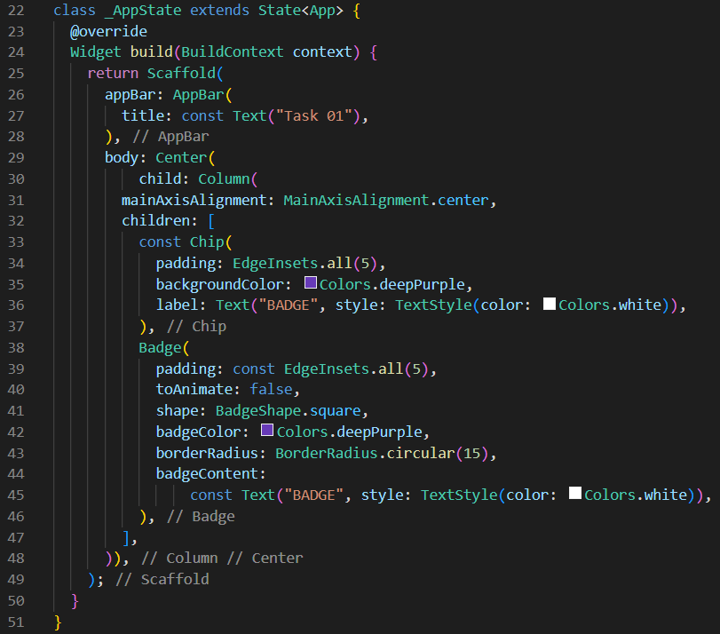
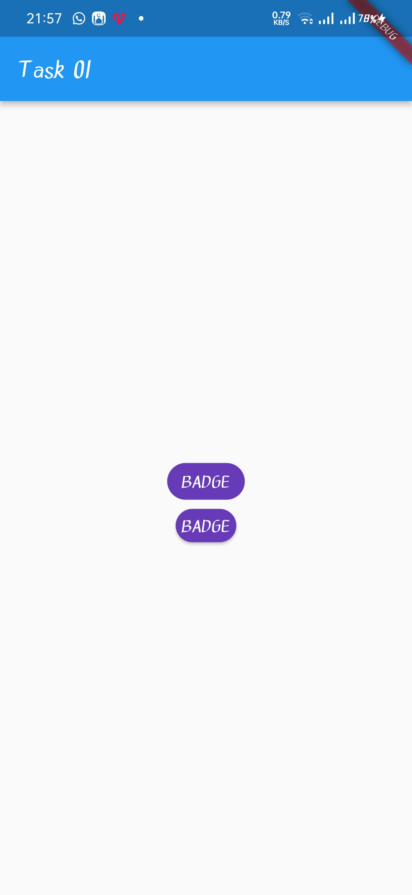
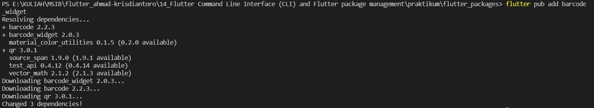
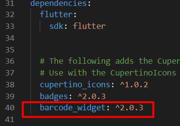
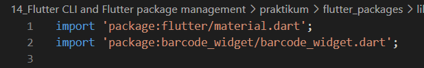
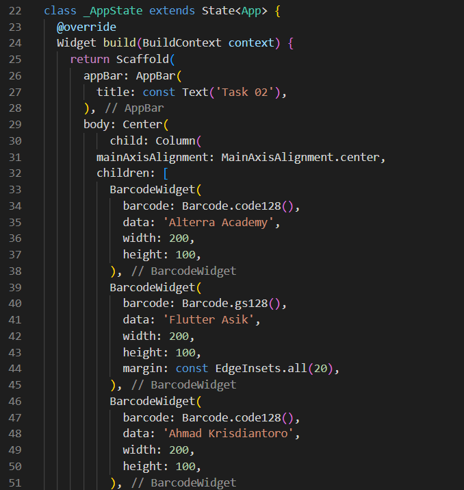
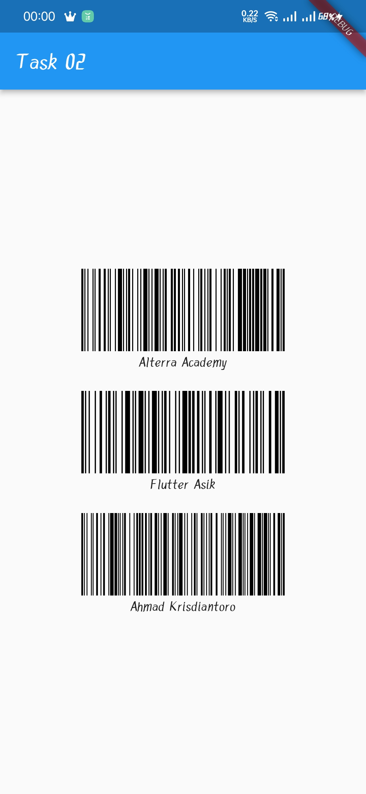

# (14) Flutter Command Line Interface (CLI) and Flutter package management

## Data Diri
Nomor Urut &nbsp;: 1_002FLB_44  
Nama &emsp;&emsp;&ensp;&nbsp;: Ahmad Krisdiantoro

## Task
### Task 01
1. Menambahkan package  
    

    Cek di file pubspec.yaml  
    

    Import package  
    

    Membuat widget menggunakan package badges  
    

    Output  
    

2. Menambahkan package  
    

    Cek di file pubspec.yaml  
    

    Import package  
    

    Membuat widget menggunakan package barcode_widget  
    

    Output  
    